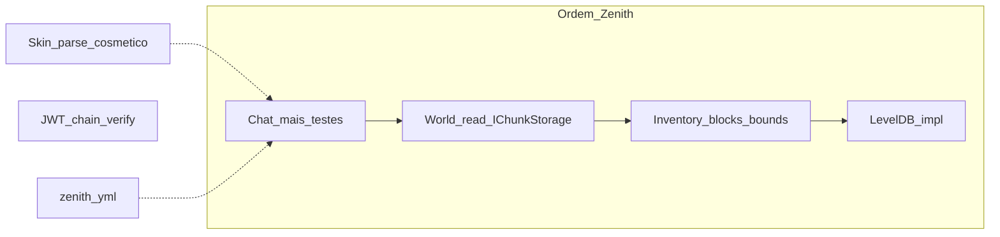

# Arquitetura Zenith

Filosofia em uma linha: **quem decide ≠ quem transmite ≠ quem serializa**.

Documentação narrativa (comparações, DX, histórico de decisões): [`docs/`](docs/README.md). Este arquivo é a **fonte de restrições** do dia a dia.

## Papéis

| Papel | Responsabilidade |
|-------|------------------|
| **Gameplay** | Decide (mundo, inventário, entidades, regras) e roda o runtime (`GameLoop` / sistemas). |
| **Handler** | Orquestra o fluxo de conexão / inbound (state machine de sessão). |
| **Protocol** | Traduz intenções já decididas em pacotes e transmite. |
| **Packets** | Modelo + serialize/deserialize do wire format Bedrock. |
| **RakNet** | Transporte UDP confiável. |

```
Quem decide?     Gameplay
Quem orquestra?  Handler (conexão) / GameLoop (tick)
Quem transmite?  Protocol
Quem serializa?  Packets
Quem envia?      RakNet
```

## Fluxos e dependências permitidas

### Outbound

```
Gameplay → Protocol → Packets → Serializer → RakNet
```

### Inbound (movimento e input de jogo)

```
RakNet thread
    → Handler
    → estado pendente (ex. MovementInputState) — só intenção
    → GameLoop Tick
    → System (ex. MovementSystem)
    → Protocol
    → RakNet
```

A thread de rede **nunca** muta estado de gameplay (posição final, inventário, mundo). Só escreve intenção pendente. Mutação acontece no tick, de forma determinística.

A seta de dependência de tipos é sempre unidirecional. Camadas inferiores não conhecem as superiores.

## Regras

1. **Protocol transmite, não decide.** Não calcula quais chunks enviar, nem o que é visível, nem inventário.
2. **Protocol não mantém estado de gameplay.** Só referência à `NetworkSession` (e infra de envio).
3. **Gameplay nunca referencia `DataPacket`** (nem `ProtocolInfo` de wire, nem `BinaryStream`).
4. **Packets nunca conhecem domínio** (`Player`, `World`, `Inventory`, …).
5. **Serializer nunca conhece domínio.**
6. **Handlers** podem decodificar pacotes inbound, validar segurança do dado (NaN/Infinity) e registrar intenção pendente — **não** alterar posição/inventário/mundo diretamente.
7. **Evitar novas abstrações** (`Factory`, `Mapper`, `Dispatcher`, `Builder`, `Scheduler`, `Actor`, `ECS`, …) sem necessidade comprovada / limitação concreta.
8. Enquanto intenção ↔ pacote for 1:1, os módulos `*Protocol` podem instanciar pacotes diretamente.

## Infra congelada

Após o GameLoop estável, **não introduzir** Scheduler, Actor Model, ECS, Job System, Service Locator, Runtime Manager ou VisibilitySystem só “por limpeza”. Novas camadas só quando uma feature concreta demonstrar limitação da arquitetura atual. Gameplay guia a evolução.

Fan-out a “todos online” (ex. TimeSync / movimento **quando pose dirty**, ADR §44) é aceitável neste estágio; Absolute/UpdateBlock no tick batelam por peer. Um futuro VisibilitySystem pode restringir peers relevantes — não implementado agora.

## GameLoop e sistemas

- **GameLoop** controla 20 TPS, avança `GameClock` e chama sistemas — **sem** regras de gameplay. Exceção em um sistema é logada e o loop continua.
- **GameClock** guarda tick / world time / TPS medido.
- **Sistemas** (`IGameSystem`): ordem de **registro** = ordem de **execução**; cada um só com a própria lógica.
- GameLoop é **single-threaded** até existir necessidade real de paralelismo.
- Tick de **jogo** ≠ tick de **RakNet** (transporte).

Proibido no GameLoop como *orquestração genérica*: DI de pacotes, chat fan-out, session wiring. Sistemas (`MovementSystem`, `BlockSystem`) mutam estado de domínio no tick — isso é o contrato inbound da regra 6.

## Layout

```
libs/
  nbt/             # Zenith.Nbt — formato NBT puro (LE + Network); sem ref a zenith/raknet
  leveldb/         # Zenith.LevelDB — KV managed; dataset ⊆ RAM
src/
  zenith/
    Gameplay/
      Runtime/     # GameLoop, GameClock, IGameSystem
      Systems/     # TimeSyncSystem, MovementSystem, BlockSystem, …
    World/         # World façade, Dimension, IChunkStorage, Blocks, Noise/ (FastNoiseLite), chests, floor drops
    Player/        # Player, intents, inventory, manager
    Server/        # ZenithServer, ServerContext, config, identity
    Event/ Log/
    Packets/       # DataPacket + ProtocolInfo — serialize only (sem Server/World)
    Protocol/      # *Protocol, ProtocolGate, ColumnSend — transmit
    Session/       # NetworkSession, handlers, ZenithSessionListener, PlayerVisibility
    data/          # block_palette.nbt, item_palette.json, creative_items.json (EmbeddedResource)
  raknet/
```

Pastas = papéis (decide / transmit / serialize). Não recriar um catch-all `Network/`.

## Blocos / itens — fundação (§55)

```
A Wire registry     BlockPalette / ItemPalette (dump completo)
B Stack identity    StackId(Kind=Block|Item, Value) — inventário/chest/floor
C Capability maps   DigProfiles / Tools (= ToolProfiles façade) — sem hierarquia Item/Block
```

- Overlay / `GetBlock` = só `BlockRuntimeId`.
- Dig Survival sem entrada em `DigProfiles` = sem auth (não inventar DestroySpeed).
- Protocol mapeia `StackId` → `NetworkItemStack` (`ItemNetworkId` + `BlockRuntimeId` + `StackNetworkId` ISR).
- Recipes = exact `StackId` (sem merge de facing).
- Domínios pesados (double-chest §56, gravity §57, fluid, redstone) = ADR + system próprios — não colunas num DigProfile. Gravity = cell-tick pending + UpdateBlock (sem Tile / FallingBlock entity).
- Glossário e receita de contribuidor: [`docs/dx.md`](docs/dx.md), ADR §55.

## Notas deste estágio

- PreSpawn **lê** colunas via `World`/`IChunkStorage` (thread-safe, `ValueTask`); Protocol só transmite. Por coluna: `LevelChunk` (base) → `UpdateBlock` dos overlays.
- Mutação de bloco: **overlay esparso permanente** (`ov:` no LevelDB) + `UpdateBlock` — nunca reescreve subchunk. `_blockOverrides` em RAM: SoftCap `10_000` em chaves **novas** + compactação quando rid == base flat (ADR §36); overwrite sempre ok. `FloorDropStore` SoftCap refuse em células novas; chests SoftCap `10_000` em células novas.
- Terreno base via `ITerrainProvider` on a **Dimension** (default overworld — ADR §71); `noise` = FastNoiseLite height + continuous climate bias + worm caves + ore + surface features (§63–§67/§71/§72); edits = diff sobre a base (§62).
- **NBT:** `Zenith.Nbt` no fundo do grafo de deps (LE / Network / BigEndian). Palette `src/zenith/data/block_palette.nbt` = gzip + **BigEndian** (dump BDS/Java-style); gunzip → decode → `network_id` por nome. `Blocks.*` no boot. PropertyData = NBT **Network**.
- **LevelDB:** `Zenith.LevelDB` (managed, no mesmo fundo do grafo que Nbt) — KV próprio; **dataset ⊆ RAM** enquanto aberto (snapshot+WAL); **não** lê mundos vanilla Mojang nem DBs do NuGet antigo. `LevelDbChunkStorage`; `world.path` no YAML. Sem silent fallback. Chaves via `WorldStorageKeys` (`c:` / `ov:` / `ct:` / `inv:` / `pd:`). Detalhes: [`libs/leveldb/README.md`](libs/leveldb/README.md). Abrir/converter mundos BDS = backend/`IChunkStorage` + conversor offline (ADR §61) — não reescrever ZLDB como LSM Mojang.
- **World subdomains (§62/§71):** Dimension (terrain + wire id) · overlay grid · persistence port · block registry · containers · floor/gravity · packed blobs — `World` is the façade; files stay under `World/` until a later cut.
- Chat: `ChatProtocol` + rate limit por player; comandos `/` fora de escopo.
- **Config:** `zenith.yml` ao lado do executável (`AppContext.BaseDirectory`), ou `{ZENITH_DATA}/zenith.yml` quando `ZENITH_DATA` está definido (Docker/Dokploy — volume único em `/data`). Sem matriz `ZENITH_*` além desse root.
- JWT: parse + skin opcional; `auth.accept` no YAML (xbox / self-signed / offline); aviso no boot se não for só `xbox`.
- **Item palette:** `ItemPalette` no `ServerContext` (JSON embedded); `ItemRegistryPacket` após StartGame. Inventário de domínio = `StackId` (ADR §55); map wire no Protocol. `Blocks.*` static = dívida conhecida — novos registries via Context.
- Visibilidade join/leave: `PlayerVisibility` + `EntityProtocol`; pose só no `MovementSystem`.
- **EventBus:** infra reservada (Publish login/quit); sem consumidores de domínio ainda. `Publish` isola exceção por listener (como GameLoop).
- **i18n (futuro):** quando implementado, usar `lang/*.toml` (TOML) — Norway problem do YAML em strings de tradução + catálogo chave→string com diff mais limpo. Config operacional permanece em `zenith.yml`.

## Smoke manual

Baseline (multiplayer spine) — status humano Jul 2026 (Dokploy compose + 1–2 clients). Checklist canónico: [`docs/alpha-gate.md`](docs/alpha-gate.md).

| # | Gate | Status |
|---|------|--------|
| 1 | Cliente A: login → InGame (chão flat sob os pés). | **OK** |
| 2 | AuthInput: servidor atualiza `Player` position. | **OK** |
| 3 | Cliente B: login → InGame; A e B se veem (`PlayerList` + `AddPlayer`). | **OK** |
| 4 | Movimento de A visível em B (`MoveActorAbsolute`). | **OK** |
| 5 | Chat A↔B (`TextPacket`). | **OK** |
| 6 | A coloca bloco; B (já online ou entrando depois) vê o bloco (`UpdateBlock` após `LevelChunk`); hotbar sync. | **OK** (era PARCIAL AFK join-miss → join-overlay catch-up §14) |
| 7 | Terreno flat (stone/grass) visível — `UseBlockNetworkIdHashes` + `ItemRegistry` após StartGame. | **OK** |
| 8 | A quebra bloco → item volta ao inventário (servidor + sync); sem drop entity. | **OK** |
| 9 | B desconecta: A remove o actor (`PlayerList` REMOVE + `RemoveActor`). | **OK** |
| 10 | A anda para fora do raio de spawn → novas colunas flat (`ChunkStreamSystem`). | **OK** |
| 11 | **§17 rearrange:** drag / SHIFT hotbar↔inv; place/break; sem rubberband. | **OK** (press-drag extremo = polish pós-alpha) |
| 12 | **Held peer:** A troca hotbar → B vê item na mão (`MobEquipment` / `AddPlayer` held). | **OK** |

Levas §35–§42 (confiança operacional — void MovePlayer + shutdown flush + crack peers):

| Id | Gate | Status (Jul 2026) |
|----|------|-------------------|
| **S35** | Survival: 1 oak log → 4 planks; 8 planks → 1 chest (2×2 craft). | **OK** (cadeia planks→chest após emit CreatedOutput) |
| **S37** | Creative: pode voar; Survival: sem MayFly. | **OK** |
| **S38** | Creative: palette click → **cursor**; SHIFT → bag; place; Survival rejeita CraftCreative. | **OK** |
| **S39** | `world.path` LevelDB: mutar bag + baú → **graceful shutdown (Ctrl+C)** → restart → mesmo UUID / baú intactos. | **OK** |
| **S39b** | Quit do cliente (`HandleClose`) ainda persiste inventário. | **OK** |
| **S40** | Cair no void: death screen (`DeathInfo` + Respawn); Respawn → spawn `(0, FlatSpawnY, 0)`; inventário intacto; Health 20. | **OK** (Jul 2026) |
| **H1-2** | Survival void → death UI → Respawn limpa; bag/chest inalterados; peer vê pose. | **OK** (Jul 2026) |
| **S41** | A diga bloco Survival: **B** vê crack LevelEvent; abort/break limpa crack em B. | **OK** |
| **H1-1** | A bag cheia → break → **B** vê item entity; A anda em cima → TakeItem + bag (partial stack space OK). | **OK** (AABB expand + delay 10, §26) |
| **H1-1-1** | Stack parcial (ex. grama 62) → break → item **vai ao inventário** (sem cair no chão). | **OK** (Jul 2026) |
| **H1-3** | `/gamemode creative` → fly + UI; `/gamemode survival`; sem WARNING 77; peer **não** vê `/` no chat. | **OK** (Jul 2026) |
| **H1-3b** | A `/gamemode creative` → B vê Creative (re-AddPlayer) **sem** B reentrar (§59). | **OK** |
| **Logs §50** | Boot default: join Info, sem flood `Connected PID`. | **OK** (Jul 2026) |
| **Skin §49/§59** | Join: peers veem skin completa sem mid-game change; mid-game PlayerSkin ainda relay. | **OK** |
| **Sound §59** | A place/break → B ouve LevelSoundEvent; dig hit audível. | Pendente (smoke humano) |
| Crash soft | Hard kill (`taskkill /F` / `kill -9`) → restart: overlays/WAL may survive; recent `inv:`/`ct:` not guaranteed. | **OK** (Jul 2026) |
| Regressão | Held peer, rearrange, break/crack still OK. | **OK** |

**Follow-ups (fora do gate, anotados no smoke):** double-click gather de stacks (intermitente). **H1-1 drops após restart do processo** = Known debt §26 (FloorDropStore RAM-only; sem LevelDB). Leave+rejoin **mesmo processo** deve reemitir AddItemActor via overlay resync.

Gates: se item **11** falhar, não começar containers. Se **S39** ou **S41** falharem, não abrir leaves dependentes.

## Roadmap

Espinha: **Chat → World in-memory → Inventory/blocks → LevelDB**, skins cosméticas em paralelo. Não espelhar Actor→Events; Zenith já usa `GameLoop` + pending input.

Config operacional (`zenith.yml`) **não** é uma “fase de gameplay”; entra cedo para não depender de env. i18n fica **depois** de haver mensagens de jogador estáveis.



`JwtGate` fica fora da cadeia de gameplay: gate de **exposição pública** (LAN ≠ público), independente da fase.

### Fase 1 — Chat (+ testes + higiene) — feita neste marco

- `TextPacket` + `ChatProtocol`; rate limit por `Player` (`TokenBucketRateLimiter`) + tamanho máximo.
- Projeto `zenith.Tests` cobre `LoginIdentity` e formatação/`TextPacket` roundtrip.
- Comandos `/` **fora**.

### Fase 2 — World in-memory — feita neste marco

- Mundo **read-only** para colunas: leitura fora do tick (PreSpawn) via `ConcurrentDictionary` + chunk imutável após `Put`.
- `IChunkStorage` com **`ValueTask`** desde o dia 1 (InMemory sync por baixo) para LevelDB não obrigar rewrite sync na rede.
- Mutação de coluna CoW **não** resolvida aqui.

### Fase 3 — Inventário / blocs — checklist de autoridade player fechado (§15–17)

Não significa “produto completo”: fecha place/break + inventário 36 + ISR rearrange no domínio do **jogador**.

- Intent pendente → `BlockSystem` → overlay + `UpdateBlock`; place consome hotbar.
- Bounds de coordenada, slot `0..8` e stack count no handler.
- Overlay permanente (não CoW de coluna).
- Tick authority: reach (olhos + `MaxBlockReach`), place só em air, break só se `TryAdd` couber — smoke 6/8 assumem rejeição correta (sem voidar item / sem overwrite ocupado).
- Storage 9–35 no domínio (`TryAdd` / sync `SendInventoryContent`); place / consume permanece 0–8.
- Rearrange 0–35 via ISR: intent → `InventorySystem` tick → `ItemStackResponse` (SAI on; net IDs no Protocol).

**Gaps conscientes (ainda abertos):** bag persist reconnect is partial (`players/` leaf still Horizon‑1); drop/destroy ISR deferred. **Shipped since this checklist was written:** chests (§28) + double-chest sneak-place/54 UI (§56); held peer sync (§18); inventory persist on quit (§39); Survival dig timing (§27); floor drops (§26).

LAN pode usar `auth.accept` com `self-signed` / `offline` (aviso no boot). **Exposição pública:** `accept: [xbox]` apenas.

### Fase 4 — LevelDB

- `LevelDbChunkStorage`; `world.path` no `zenith.yml` = data root; LevelDB em `{path}/worlds/{world.name}/` (ADR §20).
- Path vazio = InMemory; falha ao abrir LevelDB **não** cai em InMemory silenciosamente.
- Chaves Zenith `c:` + `ov:` (não formato vanilla Mojang).
- Product release version: `ServerIdentity.ProductVersion` (≠ protocol `VersionName`).

### Extensão futura (forma)

Quando extensibilidade externa existir: `EventBus.Subscribe<T>` primeiro — não `GameLoop.Register` público nem hooks em `Protocol.Send*` (ADR §21). Plugin API continua frozen.
### Identidade

| Item | Natureza | Quando |
|------|----------|--------|
| Parse de skin | Cosmético | Paralelo (ClientData) |
| UUID do JWT `identity` | Identidade | No login |
| Verificação de assinatura da chain | Segurança | `auth.accept: [xbox]` no YAML; **obrigatório antes de exposição pública** |

### Explicitamente fora da sequência curta

- Actor / job channel, framework EventHandlers, VisibilitySystem, ECS
- Anti-cheat, Snappy zero-copy
- DI container, Plugin API
- Commands / Permission (`/` adiado de propósito)
- i18n runtime (ver nota TOML acima)