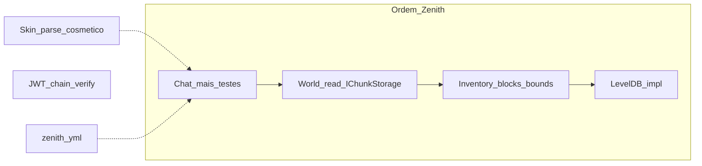

# Arquitetura Zenith

Filosofia em uma linha: **quem decide ≠ quem transmite ≠ quem serializa**.

Documentação narrativa (comparações, DX, histórico de decisões): [`docs/`](docs/README.md). Este arquivo é a **fonte de restrições** do dia a dia.

## Papéis

| Papel | Responsabilidade |
|-------|------------------|
| **Gameplay** | Decide (mundo, inventário, entidades, regras) e roda o runtime (`GameLoop` / sistemas). |
| **Handler** | Orquestra o fluxo de conexão / inbound (state machine de sessão). |
| **Protocol** | Traduz intenções já decididas em pacotes e transmite. |
| **Packets** | Modelo + serialize/deserialize do wire format Bedrock. |
| **RakNet** | Transporte UDP confiável. |

```
Quem decide?     Gameplay
Quem orquestra?  Handler (conexão) / GameLoop (tick)
Quem transmite?  Protocol
Quem serializa?  Packets
Quem envia?      RakNet
```

## Fluxos e dependências permitidas

### Outbound

```
Gameplay → Protocol → Packets → Serializer → RakNet
```

### Inbound (movimento e input de jogo)

```
RakNet thread
    → Handler
    → estado pendente (ex. MovementInputState) — só intenção
    → GameLoop Tick
    → System (ex. MovementSystem)
    → Protocol
    → RakNet
```

A thread de rede **nunca** muta estado de gameplay (posição final, inventário, mundo). Só escreve intenção pendente. Mutação acontece no tick, de forma determinística.

A seta de dependência de tipos é sempre unidirecional. Camadas inferiores não conhecem as superiores.

## Regras

1. **Protocol transmite, não decide.** Não calcula quais chunks enviar, nem o que é visível, nem inventário.
2. **Protocol não mantém estado de gameplay.** Só referência à `NetworkSession` (e infra de envio).
3. **Gameplay nunca referencia `DataPacket`** (nem `ProtocolInfo` de wire, nem `BinaryStream`).
4. **Packets nunca conhecem domínio** (`Player`, `World`, `Inventory`, …).
5. **Serializer nunca conhece domínio.**
6. **Handlers** podem decodificar pacotes inbound, validar segurança do dado (NaN/Infinity) e registrar intenção pendente — **não** alterar posição/inventário/mundo diretamente.
7. **Evitar novas abstrações** (`Factory`, `Mapper`, `Dispatcher`, `Builder`, `Scheduler`, `Actor`, `ECS`, …) sem necessidade comprovada / limitação concreta.
8. Enquanto intenção ↔ pacote for 1:1, os módulos `*Protocol` podem instanciar pacotes diretamente.

## Infra congelada

Após o GameLoop estável, **não introduzir** Scheduler, Actor Model, ECS, Job System, Service Locator, Runtime Manager ou VisibilitySystem só “por limpeza”. Novas camadas só quando uma feature concreta demonstrar limitação da arquitetura atual. Gameplay guia a evolução.

Fan-out a “todos online” (ex. TimeSync / movimento) é aceitável neste estágio; um futuro VisibilitySystem pode restringir peers relevantes — não implementado agora.

## GameLoop e sistemas

- **GameLoop** controla 20 TPS, avança `GameClock` e chama sistemas — **sem** regras de gameplay. Exceção em um sistema é logada e o loop continua.
- **GameClock** guarda tick / world time / TPS medido.
- **Sistemas** (`IGameSystem`): ordem de **registro** = ordem de **execução**; cada um só com a própria lógica.
- GameLoop é **single-threaded** até existir necessidade real de paralelismo.
- Tick de **jogo** ≠ tick de **RakNet** (transporte).

Proibido no GameLoop como *orquestração genérica*: DI de pacotes, chat fan-out, session wiring. Sistemas (`MovementSystem`, `BlockSystem`) mutam estado de domínio no tick — isso é o contrato inbound da regra 6.

## Layout

```
zenith/
  Gameplay/
    Runtime/     # GameLoop, GameClock, IGameSystem
    Systems/     # TimeSyncSystem, MovementSystem, BlockSystem, …
  World/         # IChunkStorage, World, BlockPalette (gzip→LE NBT)
  Network/
    ...
nbt/             # Zenith.Nbt — formato NBT puro (LE + Network); sem ref a zenith/raknet
raknet/
```

## Notas deste estágio

- PreSpawn **lê** colunas via `World`/`IChunkStorage` (thread-safe, `ValueTask`); Protocol só transmite. Por coluna: `LevelChunk` (base) → `UpdateBlock` dos overlays.
- Mutação de bloco: **overlay esparso permanente** (`ov:` no LevelDB) + `UpdateBlock` — nunca reescreve subchunk. `_blockOverrides` em RAM **não tem bound** (limitação conhecida nesta escala).
- Terreno base flat (`ChunkPayloads.BuildFlatOverworld`); edits = diff sobre a base.
- **NBT:** `Zenith.Nbt` no fundo do grafo de deps (LE / Network / BigEndian). Palette `data/block_palette.nbt` = gzip + **BigEndian** (dump BDS/Java-style); gunzip → decode → `network_id` por nome. `Blocks.*` no boot. PropertyData = NBT **Network**.
- **LevelDB:** `Zenith.LevelDB` (managed, no mesmo fundo do grafo que Nbt) — KV próprio; **não** lê mundos vanilla Mojang nem DBs escritos pelo NuGet antigo. `LevelDbChunkStorage`; `world.path` no YAML liga InMemory (vazio) ou LevelDB (path). Sem silent fallback. Chaves `c:` (base) e `ov:` (edits). Path antigo do NuGet = recriar mundo. Detalhes/API/gaps: [`leveldb/README.md`](leveldb/README.md).
- Chat: `ChatProtocol` + rate limit por player; comandos `/` fora de escopo.
- **Config:** `zenith.yml` ao lado do executável (`AppContext.BaseDirectory`), fonte da verdade operacional (porta, MOTD, auth, world.path, chat, compression). Sem `ZENITH_*` env.
- JWT: parse + skin opcional; `auth.require-chain-signatures: true` no YAML endurece o gate (aviso no boot se false).
- Visibilidade join/leave: `PlayerVisibility` + `EntityProtocol`; pose só no `MovementSystem`.
- **EventBus:** infra reservada (Publish login/quit); sem consumidores de domínio ainda. `Publish` isola exceção por listener (como GameLoop).
- **i18n (futuro):** quando implementado, usar `lang/*.toml` (TOML) — Norway problem do YAML em strings de tradução + catálogo chave→string com diff mais limpo. Config operacional permanece em `zenith.yml`.

## Smoke manual

1. Cliente A: login → InGame (chão flat sob os pés).
2. AuthInput: servidor atualiza `Player` position.
3. Cliente B: login → InGame; A e B se veem (`PlayerList` + `AddPlayer`).
4. Movimento de A visível em B (`MoveActorAbsolute`).
5. Chat A↔B (`TextPacket`).
6. A coloca bloco; B (já online ou entrando depois) vê o bloco (`UpdateBlock` após `LevelChunk`).
7. Terreno flat (stone/grass) visível sob os pés — `UseBlockNetworkIdHashes` alinhado às palettes FNV.
8. B desconecta: A remove o actor (`PlayerList` REMOVE + `RemoveActor`).

## Roadmap

Espinha: **Chat → World in-memory → Inventory/blocks → LevelDB**, skins cosméticas em paralelo. Não espelhar Actor→Events; Zenith já usa `GameLoop` + pending input.

Config operacional (`zenith.yml`) **não** é uma “fase de gameplay”; entra cedo para não depender de env. i18n fica **depois** de haver mensagens de jogador estáveis.



`JwtGate` fica fora da cadeia de gameplay: gate de **exposição pública** (LAN ≠ público), independente da fase.

### Fase 1 — Chat (+ testes + higiene) — feita neste marco

- `TextPacket` + `ChatProtocol`; rate limit por `Player` (`TokenBucketRateLimiter`) + tamanho máximo.
- Projeto `zenith.Tests` cobre `LoginIdentity` e formatação/`TextPacket` roundtrip.
- Comandos `/` **fora**.

### Fase 2 — World in-memory — feita neste marco

- Mundo **read-only** para colunas: leitura fora do tick (PreSpawn) via `ConcurrentDictionary` + chunk imutável após `Put`.
- `IChunkStorage` com **`ValueTask`** desde o dia 1 (InMemory sync por baixo) para LevelDB não obrigar rewrite sync na rede.
- Mutação de coluna CoW **não** resolvida aqui.

### Fase 3 — Inventário / blocs

- Intent pendente → `BlockSystem` → overlay + `UpdateBlock`; place consome hotbar.
- Bounds de coordenada, slot `0..8` e stack count no handler.
- Overlay permanente (não CoW de coluna).

### Fase 4 — LevelDB

- `LevelDbChunkStorage`; `world.path` no `zenith.yml`.
- Path vazio = InMemory; falha ao abrir LevelDB **não** cai em InMemory silenciosamente.
- Chaves Zenith `c:` + `ov:` (não formato vanilla Mojang).

### Identidade

| Item | Natureza | Quando |
|------|----------|--------|
| Parse de skin | Cosmético | Paralelo (ClientData) |
| UUID do JWT `identity` | Identidade | No login |
| Verificação de assinatura da chain | Segurança | `auth.require-chain-signatures: true` no YAML; **obrigatório antes de exposição pública** |

### Explicitamente fora da sequência curta

- Actor / job channel, framework EventHandlers, VisibilitySystem, ECS
- Anti-cheat, Snappy zero-copy
- DI container, Plugin API
- Commands / Permission (`/` adiado de propósito)
- i18n runtime (ver nota TOML acima)