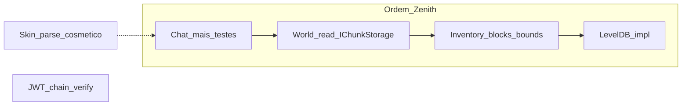

# Arquitetura Zenith

Filosofia em uma linha: **quem decide ≠ quem transmite ≠ quem serializa**.

## Papéis

| Papel | Responsabilidade |
|-------|------------------|
| **Gameplay** | Decide (mundo, inventário, entidades, regras) e roda o runtime (`GameLoop` / sistemas). |
| **Handler** | Orquestra o fluxo de conexão / inbound (state machine de sessão). |
| **Protocol** | Traduz intenções já decididas em pacotes e transmite. |
| **Packets** | Modelo + serialize/deserialize do wire format Bedrock. |
| **RakNet** | Transporte UDP confiável. |

```
Quem decide?     Gameplay
Quem orquestra?  Handler (conexão) / GameLoop (tick)
Quem transmite?  Protocol
Quem serializa?  Packets
Quem envia?      RakNet
```

## Fluxos e dependências permitidas

### Outbound

```
Gameplay → Protocol → Packets → Serializer → RakNet
```

### Inbound (movimento e input de jogo)

```
RakNet thread
    → Handler
    → estado pendente (ex. MovementInputState) — só intenção
    → GameLoop Tick
    → System (ex. MovementSystem)
    → Protocol
    → RakNet
```

A thread de rede **nunca** muta estado de gameplay (posição final, inventário, mundo). Só escreve intenção pendente. Mutação acontece no tick, de forma determinística.

A seta de dependência de tipos é sempre unidirecional. Camadas inferiores não conhecem as superiores.

## Regras

1. **Protocol transmite, não decide.** Não calcula quais chunks enviar, nem o que é visível, nem inventário.
2. **Protocol não mantém estado de gameplay.** Só referência à `NetworkSession` (e infra de envio).
3. **Gameplay nunca referencia `DataPacket`** (nem `ProtocolInfo` de wire, nem `BinaryStream`).
4. **Packets nunca conhecem domínio** (`Player`, `World`, `Inventory`, …).
5. **Serializer nunca conhece domínio.**
6. **Handlers** podem decodificar pacotes inbound, validar segurança do dado (NaN/Infinity) e registrar intenção pendente — **não** alterar posição/inventário/mundo diretamente.
7. **Evitar novas abstrações** (`Factory`, `Mapper`, `Dispatcher`, `Builder`, `Scheduler`, `Actor`, `ECS`, …) sem necessidade comprovada / limitação concreta.
8. Enquanto intenção ↔ pacote for 1:1, os módulos `*Protocol` podem instanciar pacotes diretamente.

## Infra congelada

Após o GameLoop estável, **não introduzir** Scheduler, Actor Model, ECS, Job System, Service Locator, Runtime Manager ou VisibilitySystem só “por limpeza”. Novas camadas só quando uma feature concreta demonstrar limitação da arquitetura atual. Gameplay guia a evolução.

Fan-out a “todos online” (ex. TimeSync / movimento) é aceitável neste estágio; um futuro VisibilitySystem pode restringir peers relevantes — não implementado agora.

## GameLoop e sistemas

- **GameLoop** controla 20 TPS, avança `GameClock` e chama sistemas — **sem** regras de gameplay. Exceção em um sistema é logada e o loop continua.
- **GameClock** guarda tick / world time / TPS medido.
- **Sistemas** (`IGameSystem`): ordem de **registro** = ordem de **execução**; cada um só com a própria lógica.
- GameLoop é **single-threaded** até existir necessidade real de paralelismo.
- Tick de **jogo** ≠ tick de **RakNet** (transporte).

Proibido no GameLoop como *orquestração genérica*: DI de pacotes, chat fan-out, session wiring. Sistemas (`MovementSystem`, `BlockSystem`) mutam estado de domínio no tick — isso é o contrato inbound da regra 6.

## Layout

```
zenith/
  Gameplay/
    Runtime/     # GameLoop, GameClock, IGameSystem
    Systems/     # TimeSyncSystem, MovementSystem, BlockSystem, …
  World/         # IChunkStorage (ValueTask), InMemory / LevelDB, World
  Network/
    Session/     # NetworkSession, handlers, LoginIdentity
    Protocol/    # BedrockProtocol façade + Login/World/Entity/Chat/…
    Packets/     # DataPacket, ProtocolInfo, PacketCompression, *Packet
    ZenithSessionListener.cs
  Server/        # Composition root (ZenithServer, ServerContext)
  Player/
```

## Notas deste estágio

- `Player.Session` é aceitável; fan-out via sistemas (TimeSync, Movement, Block), não espalhar `player.Session.Protocol.*` no domínio.
- PreSpawn **lê** colunas via `World`/`IChunkStorage` (thread-safe, `ValueTask`); Protocol só transmite.
- Mutação de bloco: overlay esparso em `World` + `UpdateBlock` (não CoW de coluna nesta fase).
- Chat: `ChatProtocol` + rate limit por player; comandos `/` fora de escopo.
- JWT: parse + skin opcional; `ZENITH_REQUIRE_AUTH=1` endurece gate de chain (ver Roadmap).
- Visibilidade join/leave: `PlayerVisibility` + `EntityProtocol`; pose só no `MovementSystem`.

## Smoke manual

1. Cliente A: login → InGame.
2. AuthInput: servidor atualiza `Player` position.
3. Cliente B: login → InGame; A e B se veem (`PlayerList` + `AddPlayer`).
4. Movimento de A visível em B (`MoveActorAbsolute`).
5. Chat A→B (`TextPacket`).
6. B desconecta: A remove o actor (`PlayerList` REMOVE + `RemoveActor`).

## Roadmap

Espinha: **Chat → World in-memory → Inventory/blocks → LevelDB**, skins cosméticas em paralelo. Não espelhar Actor→Events; Zenith já usa `GameLoop` + pending input.



`JwtGate` fica fora da cadeia de gameplay: gate de **exposição pública** (LAN ≠ público), independente da fase.

### Fase 1 — Chat (+ testes + higiene) — feita neste marco

- `TextPacket` + `ChatProtocol`; rate limit por `Player` (`TokenBucketRateLimiter`) + tamanho máximo.
- Projeto `zenith.Tests` cobre `LoginIdentity` e formatação/`TextPacket` roundtrip.
- Comandos `/` **fora**.

### Fase 2 — World in-memory — feita neste marco

- Mundo **read-only** para colunas: leitura fora do tick (PreSpawn) via `ConcurrentDictionary` + chunk imutável após `Put`.
- `IChunkStorage` com **`ValueTask`** desde o dia 1 (InMemory sync por baixo) para LevelDB não obrigar rewrite sync na rede.
- Mutação de coluna CoW **não** resolvida aqui.

### Fase 3 — Inventário / blocs — bootstrap neste marco

- Intent pendente → `BlockSystem` → `UpdateBlock`.
- Bounds de coordenada e hotbar no handler.
- Publicação de mutação: **overlay esparso** (não CoW de coluna inteira). CoW granular continua opção futura se o overlay não bastar.

### Fase 4 — LevelDB — bootstrap neste marco

- `LevelDbChunkStorage` + env `ZENITH_WORLD_PATH`; default permanece InMemory.
- Chaves Zenith (não formato vanilla Mojang). Vanilla decode = conteúdo futuro.

### Identidade

| Item | Natureza | Quando |
|------|----------|--------|
| Parse de skin | Cosmético | Paralelo (ClientData) |
| UUID do JWT `identity` | Identidade | No login |
| Verificação de assinatura da chain | Segurança | `ZENITH_REQUIRE_AUTH=1`; **obrigatório antes de exposição pública** |

### Explicitamente fora da sequência curta

- Actor / job channel, framework EventHandlers, VisibilitySystem, ECS
- Anti-cheat, Snappy zero-copy
- DI container, Plugin API
- Commands / Permission (`/` adiado de propósito)
