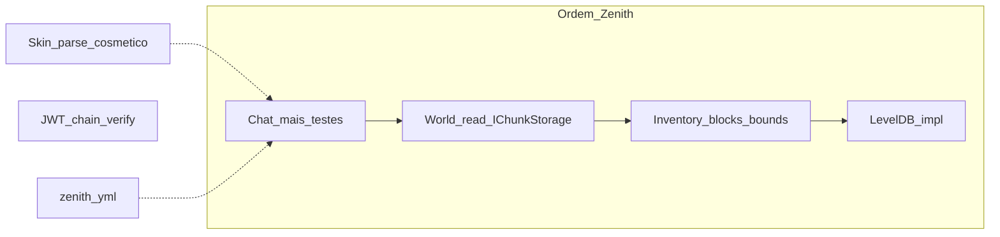

# Arquitetura Zenith

Filosofia em uma linha: **quem decide ≠ quem transmite ≠ quem serializa**.

Documentação narrativa (comparações, DX, histórico de decisões): [`docs/`](docs/README.md). Este arquivo é a **fonte de restrições** do dia a dia.

## Papéis

| Papel | Responsabilidade |
|-------|------------------|
| **Gameplay** | Decide (mundo, inventário, entidades, regras) e roda o runtime (`GameLoop` / sistemas). |
| **Handler** | Orquestra o fluxo de conexão / inbound (state machine de sessão). |
| **Protocol** | Traduz intenções já decididas em pacotes e transmite. |
| **Packets** | Modelo + serialize/deserialize do wire format Bedrock. |
| **RakNet** | Transporte UDP confiável. |

```
Quem decide?     Gameplay
Quem orquestra?  Handler (conexão) / GameLoop (tick)
Quem transmite?  Protocol
Quem serializa?  Packets
Quem envia?      RakNet
```

## Fluxos e dependências permitidas

### Outbound

```
Gameplay → Protocol → Packets → Serializer → RakNet
```

### Inbound (movimento e input de jogo)

```
RakNet thread
    → Handler
    → estado pendente (ex. MovementInputState) — só intenção
    → GameLoop Tick
    → System (ex. MovementSystem)
    → Protocol
    → RakNet
```

A thread de rede **nunca** muta estado de gameplay (posição final, inventário, mundo). Só escreve intenção pendente. Mutação acontece no tick, de forma determinística.

### Single-writer ownership

Estado autoritativo de gameplay normalmente tem **um único escritor**: seu contexto de execução
de gameplay (hoje, o `GameLoop`). Rede e workers assíncronos são produtores de mensagens
imutáveis; publicam inputs ou conclusões em handoffs limitados, e o tick revalida/aplica o
resultado. Locks e atomics continuam adequados para filas, sessões, storage, caches e métricas,
mas não devem transformar campos compostos de domínio em estado com múltiplos escritores.

`single-writer ownership ≠ single-thread entire server`: I/O, compressão, rede e persistência
continuam concorrentes. A restrição é sobre quem decide e aplica mutações autoritativas de
`Player`, `World`, inventário, combate e estado equivalente. Nunca manter lock durante await,
I/O, envio de protocolo ou callback externo.

Antes de criar um handoff para o `GameLoop`, prove que o resultado precisa mutar/dependender de
estado autoritativo ou participar do ordering determinístico do gameplay. Antes de permitir uma
mutação fora do owner, prove que ela não é estado autoritativo — ou registre uma exceção concreta.
Concorrência fora dessa autoridade é esperada quando melhora isolamento, throughput ou latência;
não crie intents/queues para logging, métricas, storage, conexão, cache ou compressão por reflexo.

### Correctness-critical transitions

Não descreva subsistemas como “anti-dup” por impressão geral. Para estado autoritativo valioso,
defina e teste a propriedade concreta: input do cliente não cria item por si só; uma request aceita
tem um único commit; falha/rejeição preserva o estado; request/session/resultados stale não se
aplicam; replay não cria novo estado; cancelamento/disconnect não deixa commit parcial. Para uma
operação que move recursos, teste conservação através de todos os participantes. Proteções de
generation, request id ou snapshot só devem ser adicionadas onde esse risco real existe.

A seta de dependência de tipos é sempre unidirecional. Camadas inferiores não conhecem as superiores.

## Regras

1. **Protocol transmite, não decide.** Não calcula quais chunks enviar, nem o que é visível, nem inventário.
2. **Protocol não mantém estado de gameplay.** Só referência à `NetworkSession` (e infra de envio).
3. **Gameplay nunca referencia `DataPacket`** (nem `ProtocolInfo` de wire, nem `BinaryStream`).
4. **Packets nunca conhecem domínio** (`Player`, `World`, `Inventory`, …).
5. **Serializer nunca conhece domínio.**
6. **Handlers** podem decodificar pacotes inbound, validar segurança do dado (NaN/Infinity) e registrar intenção pendente — **não** alterar posição/inventário/mundo diretamente.
7. **Evitar novas abstrações** (`Factory`, `Mapper`, `Dispatcher`, `Builder`, `Scheduler`, `Actor`, …) sem necessidade comprovada / limitação concreta. ECS existe desde a Fase XXI (expandido na Fase XXII) apenas para o slice Zombie/Minecart/Projectile/Cow/Skeleton/Spider (ADR §106/§107) — expandir esse slice ou introduzir ECS em outro domínio ainda exige a mesma prova.
8. Enquanto intenção ↔ pacote for 1:1, os módulos `*Protocol` podem instanciar pacotes diretamente.

## Infra congelada

Após o GameLoop estável, **não introduzir** Scheduler, Actor Model, Job System, Service Locator, Runtime Manager ou VisibilitySystem só “por limpeza”. Novas camadas só quando uma feature concreta demonstrar limitação da arquitetura atual. Gameplay guia a evolução.

**ECS deixou de ser universalmente congelado a partir da Fase XXI, expandido na Fase XXII** (ADR §106/§107) — existe um ECS real em `src/zenith/Ecs/`, autoritativo para Zombie/Minecart/Projectile/Cow/Skeleton/Spider (6 de 12 espécies). Ver [`docs/ecs.md`](docs/ecs.md) para o que existe e [`docs/phase-xxi-ecs-foundation-findings.md`](docs/history/phases/phase-xxi-ecs-foundation-findings.md)/[`docs/phase-xxii-ecs-roster-consolidation-findings.md`](docs/history/phases/phase-xxii-ecs-roster-consolidation-findings.md) para as decisões. Fora desse slice — Player, sessões, inventário, storage, packets, transporte, e as 6 espécies `IDamageableActor` restantes (Creeper, Enderman, Bat, Villager, Golem, Fish) — o congelamento permanece: não introduzir ECS/generalizar o runtime desses domínios sem uma feature concreta forçando, igual a qualquer outra camada nesta lista.

Fan-out a “todos online” (ex. TimeSync / movimento **quando pose dirty**, ADR §44) é aceitável neste estágio; Absolute/UpdateBlock no tick batelam por peer. Um futuro VisibilitySystem pode restringir peers relevantes — não implementado agora.

## Escolha de execution model (ADR §97)

`IGameSystem`/tick não é o boundary obrigatório para "qualquer coisa que não seja rede". A unidade de execução certa depende do comportamento da feature, não da abstração disponível — ver [`docs/adr/0097-runtime-execution-model.md`](docs/adr/0097-runtime-execution-model.md) para o heurístico completo.

**Estrito (não trocar sem ADR + feature concreta forçando):** transport não decide gameplay; serialization não conhece domínio; packets são só wire; handlers interpretam e chamam uma API do runtime — não são a decisão; mutação de estado autoritativo normalmente tem um único escritor no seu contexto de gameplay (hoje, o tick), com exceções explícitas e justificadas; thread ownership é explícito; nenhuma continuation assíncrona recupera autoridade após `await` — ela publica uma conclusão para o owner aplicar.

**Flexível (escolher por comportamento, revisar quando a feature mudar):** `IGameSystem`, Command, Event, Intent/pending-state, Queue, Dirty flag, Scheduler, chamada direta de runtime, Dispatcher, Service.

- **Não crie um `IGameSystem` só para tirar trabalho de um packet handler.** Se a feature não precisa de avaliação contínua nem de ordering determinístico contra outro trabalho de gameplay, uma chamada direta `Handler → Gameplay Runtime API → Domain operation` pode preservar o boundary sem esperar o próximo tick. Exemplo já existente e correto: `Player.SelectedHotbarSlot` (ADR §80) — escalar único, idempotente, sem lock, sem fila.
- **Preservar o boundary gameplay/network não implica esperar o próximo tick para tudo.** "Handler não decide" e "handler não pode chamar uma API síncrona do runtime" são coisas diferentes.
- **Antes de introduzir pending state, fila, lock, Command, Event ou System, identifique o requisito comportamental que justifica isso** (tick determinism, batching, coalescing, ordering entre jogadores, rate limiting, reconciliation, transaction semantics, dependência assíncrona real) — "porque os Systems rodam no tick" ou "porque precisamos atravessar uma camada" não são justificativas suficientes.
- **Prefira o modelo de execução mais simples que preserve autoridade, ordering, thread ownership e testabilidade** — nessa ordem de prioridade quando houver conflito.

## GameLoop e sistemas

- **GameLoop** controla 20 TPS, avança `GameClock` e chama sistemas — **sem** regras de gameplay. Exceção de sistema é registrada e encerra o loop; `ZenithServer` propaga essa falha ao lifecycle de shutdown: continuar aceitando pacotes após uma mutação autoritativa parcialmente aplicada seria esconder corrupção potencial. Recuperação/retry deve ser desenhada no boundary específico que conhece a operação; não há circuit breaker genérico.
- **Lifetime crítico:** `GameLoop` e RakNet compartilham o lifetime do servidor. A terminação inesperada de um inicia shutdown coordenado: cancelar a autoridade, bloquear novo tráfego, drenar os loops, então settle autoritativo e flush de persistência. `RunAsync` representa uma única lifetime por instância e chamadas repetidas retornam a mesma task; `ShutdownAsync` é idempotente, retorna a mesma operação de cleanup e só completa após essa sequência. Uma instância já parada não é reiniciada: crie uma nova instância em vez disso. A falha crítica permanece observável pela task de `RunAsync`, mesmo após o cleanup a colocar no estado terminal stopped.
- **GameClock** guarda tick / world time / TPS medido.
- **Sistemas** (`IGameSystem`): ordem de **registro** = ordem de **execução**; cada um só com a própria lógica.
- GameLoop é **single-threaded** até existir necessidade real de paralelismo.
- Tick de **jogo** ≠ tick de **RakNet** (transporte).

Proibido no GameLoop como *orquestração genérica*: DI de pacotes, chat fan-out, session wiring. Sistemas (`MovementSystem`, `BlockDigSystem`, `BlockEditSystem`) mutam estado de domínio no tick — isso é o contrato inbound da regra 6.

## Layout

```
libs/
  nbt/             # Zenith.Nbt — formato NBT puro (LE + Network); sem ref a zenith/raknet
  leveldb/         # Zenith.LevelDB — KV managed; dataset ⊆ RAM
src/
  zenith/
    Gameplay/
      Runtime/         # GameLoop, GameClock, IGameSystem
      Commands/        # CommandCatalog, CommandRuntime
      Entities/        # mob species (ZombieSystem, CowSystem, …) + shared combat/movement/lifecycle helpers (DamageDispatch, GroundMobMovement, ActorInterest, …)
      Survival/        # player vitals/state (HealthState, HungerSystem, EffectSystem, PlayerDamage, PlayerExperience, ArmorMitigation, FoodItems, MovementSystem, …)
      WorldInteraction/ # BlockDigSystem, BlockEditSystem, GravitySystem, FloorDropSystem, ChunkStreamSystem
      Inventory/       # InventorySystem, EquipmentSystem, RecipeRegistry, CreativeCatalog
      Replication/     # cross-domain fanout (BlockCrackFanout, ChestLidFanout, ArmorFanout, …), ChatSystem, GameModeSystem, TimeSyncSystem
    World/         # World façade, Dimension, IChunkStorage, Blocks, Noise/ (FastNoiseLite), chests, floor drops
    Player/        # Player, intents, inventory, manager
    Server/        # ZenithServer, ServerContext, config, identity
    Event/ Log/
    Packets/       # DataPacket + ProtocolInfo — serialize only (sem Server/World)
    Protocol/      # *Protocol, ProtocolGate, ColumnSend — transmit
    Session/       # NetworkSession, handlers, ZenithSessionListener, PlayerVisibility
    data/          # block_palette.nbt, item_palette.json, creative_items.json (EmbeddedResource)
  raknet/
```

Pastas = papéis (decide / transmit / serialize). Não recriar um catch-all `Network/`.

`Gameplay/` é organizado por domínio, não por mecanismo de execução: `IGameSystem` já é tratado como execution model (não como boundary — regra acima), então um antigo `Systems/` flat (agrupava tudo que "roda no tick", independente de domínio) foi abandonado. Um contribuidor deve prever a pasta pelo domínio/responsabilidade do código, não vasculhar um diretório único. Não recriar `Common/Utils/Helpers/Misc/Core/Managers/Shared/Infrastructure/Services/` dentro de `Gameplay/`.

## Blocos / itens — fundação (§55)

```
A Wire registry     BlockPalette / ItemPalette (dump completo)
B Stack identity    StackId(Kind=Block|Item, Value) — inventário/chest/floor
C Capability maps   DigProfiles / Tools (= ToolProfiles façade) — sem hierarquia Item/Block
```

- Overlay / `GetBlock` = só `BlockRuntimeId`.
- Dig Survival sem entrada em `DigProfiles` = sem auth (não inventar DestroySpeed).
- Protocol mapeia `StackId` → `NetworkItemStack` (`ItemNetworkId` + `BlockRuntimeId` + `StackNetworkId` ISR).
- Recipes = exact `StackId` (sem merge de facing).
- Domínios pesados (double-chest §56, gravity §57, fluid, redstone) = ADR + system próprios — não colunas num DigProfile. Gravity = sparse pending cells (`GravityPendingStore`) que viram um `falling_block` real via `AddActorPacket` genérico (ADR §95) enquanto caem, resolvendo em `UpdateBlock` só ao pousar — não mais teleporte instantâneo de coluna.
- Glossário e receita de contribuidor: [`docs/dx.md`](docs/dx.md), ADR §55.

## Notas deste estágio

- PreSpawn **lê** colunas via `World`/`IChunkStorage` (thread-safe, `ValueTask`); Protocol só transmite. Por coluna: `LevelChunk` (base) → `UpdateBlock` dos overlays.
- Mutação de bloco: **overlay esparso permanente** (`ov:` no LevelDB) + `UpdateBlock` — nunca reescreve subchunk. `_blockOverrides` em RAM: SoftCap `10_000` em chaves **novas** + compactação quando rid == base flat (ADR §36); overwrite sempre ok. `FloorDropStore` SoftCap refuse em células novas; chests SoftCap `10_000` em células novas.
- Terreno base via `ITerrainProvider` on a **Dimension** (default overworld — ADR §71); `noise` = FastNoiseLite height + continuous climate bias + worm caves + ore + surface features (§63–§67/§71/§72); edits = diff sobre a base (§62). Base chunks nunca são persistidos (miss = regenera do provider — §45); por isso seed/generator mode são commitados uma única vez como identidade do mundo e nunca sobrescritos silenciosamente por config (`WorldIdentity.Reconcile`, §108).
- **NBT:** `Zenith.Nbt` no fundo do grafo de deps (LE / Network / BigEndian). Palette `src/zenith/data/block_palette.nbt` = gzip + **BigEndian** (dump BDS/Java-style); gunzip → decode → `network_id` por nome. `Blocks.*` no boot. PropertyData = NBT **Network**.
- **LevelDB:** `Zenith.LevelDB` (managed, no mesmo fundo do grafo que Nbt) — KV próprio; **dataset ⊆ RAM** enquanto aberto (snapshot+WAL); **não** lê mundos vanilla Mojang nem DBs do NuGet antigo. `LevelDbChunkStorage`; `world.path` no YAML. Sem silent fallback. Chaves via `WorldStorageKeys` (`c:` / `ov:` / `ct:` / `inv:` / `pd:` — pose+xp+vitals v3, health/hunger/saturation/exhaustion, ADR §109 / `wm:` — identidade do mundo, seed+generator, ADR §108). Detalhes: [`libs/leveldb/README.md`](libs/leveldb/README.md). Abrir/converter mundos BDS = backend/`IChunkStorage` + conversor offline (ADR §61) — não reescrever ZLDB como LSM Mojang.
- **World subdomains (§62/§71):** Dimension (terrain + wire id) · overlay grid · persistence port · block registry · containers · floor/gravity · packed blobs — `World` is the façade; files stay under `World/` until a later cut.
- Chat: `ChatProtocol` + rate limit por player; comandos `/` fora de escopo.
- **Config:** `zenith.yml` ao lado do executável (`AppContext.BaseDirectory`), ou `{ZENITH_DATA}/zenith.yml` quando `ZENITH_DATA` está definido (Docker/Dokploy — volume único em `/data`). Sem matriz `ZENITH_*` além desse root.
- JWT: parse + skin opcional; `auth.accept` no YAML (xbox / self-signed / offline); aviso no boot se não for só `xbox`.
- **Item palette:** `ItemPalette` no `ServerContext` (JSON embedded); `ItemRegistryPacket` após StartGame. Inventário de domínio = `StackId` (ADR §55); map wire no Protocol. `Blocks.*` static = dívida conhecida — novos registries via Context.
- Visibilidade join/leave: `PlayerVisibility` + `EntityProtocol`; pose só no `MovementSystem`.
- **EventBus:** Publish login/quit; primeiros consumidores de domínio (ADR §78) — `PlayerPresenceAnnouncer` (join/leave system chat), registrado no composition root (`ZenithServer`). `Publish` isola exceção por listener (como GameLoop). Ainda **não** é superfície de plugin — só composição interna.
- **i18n (futuro):** quando implementado, usar `lang/*.toml` (TOML) — Norway problem do YAML em strings de tradução + catálogo chave→string com diff mais limpo. Config operacional permanece em `zenith.yml`.

## Smoke manual

Baseline (multiplayer spine) — status humano Jul 2026 (Dokploy compose + 1–2 clients). Checklist canónico: [`docs/alpha-gate.md`](docs/alpha-gate.md).

| # | Gate | Status |
|---|------|--------|
| 1 | Cliente A: login → InGame (chão flat sob os pés). | **OK** |
| 2 | AuthInput: servidor atualiza `Player` position. | **OK** |
| 3 | Cliente B: login → InGame; A e B se veem (`PlayerList` + `AddPlayer`). | **OK** |
| 4 | Movimento de A visível em B (`MoveActorAbsolute`). | **OK** |
| 5 | Chat A↔B (`TextPacket`). | **OK** |
| 6 | A coloca bloco; B (já online ou entrando depois) vê o bloco (`UpdateBlock` após `LevelChunk`); hotbar sync. | **OK** (era PARCIAL AFK join-miss → join-overlay catch-up §14) |
| 7 | Terreno flat (stone/grass) visível — `UseBlockNetworkIdHashes` + `ItemRegistry` após StartGame. | **OK** |
| 8 | A quebra bloco → item volta ao inventário (servidor + sync); sem drop entity. | **OK** |
| 9 | B desconecta: A remove o actor (`PlayerList` REMOVE + `RemoveActor`). | **OK** |
| 10 | A anda para fora do raio de spawn → novas colunas flat (`ChunkStreamSystem`). | **OK** |
| 11 | **§17 rearrange:** drag / SHIFT hotbar↔inv; place/break; sem rubberband. | **OK** (press-drag extremo = polish pós-alpha) |
| 12 | **Held peer:** A troca hotbar → B vê item na mão (`MobEquipment` / `AddPlayer` held). | **OK** |

Levas §35–§42 (confiança operacional — void MovePlayer + shutdown flush + crack peers):

| Id | Gate | Status (Jul 2026) |
|----|------|-------------------|
| **S35** | Survival: 1 oak log → 4 planks; 8 planks → 1 chest (2×2 craft). | **OK** (cadeia planks→chest após emit CreatedOutput) |
| **S37** | Creative: pode voar; Survival: sem MayFly. | **OK** |
| **S38** | Creative: palette click → **cursor**; SHIFT → bag; place; Survival rejeita CraftCreative. | **OK** |
| **S39** | `world.path` LevelDB: mutar bag + baú → **graceful shutdown (Ctrl+C)** → restart → mesmo UUID / baú intactos. | **OK** |
| **S39b** | Quit do cliente (`HandleClose`) ainda persiste inventário. | **OK** |
| **S40** | Cair no void: death screen (`DeathInfo` + Respawn); Respawn → spawn `(0, FlatSpawnY, 0)`; inventário intacto; Health 20. | **OK** (Jul 2026) |
| **H1-2** | Survival void → death UI → Respawn limpa; bag/chest inalterados; peer vê pose. | **OK** (Jul 2026) |
| **S41** | A diga bloco Survival: **B** vê crack LevelEvent; abort/break limpa crack em B. | **OK** |
| **H1-1** | A bag cheia → break → **B** vê item entity; A anda em cima → TakeItem + bag (partial stack space OK). | **OK** (AABB expand + delay 10, §26) |
| **H1-1-1** | Stack parcial (ex. grama 62) → break → item **vai ao inventário** (sem cair no chão). | **OK** (Jul 2026) |
| **H1-3** | `/gamemode creative` → fly + UI; `/gamemode survival`; sem WARNING 77; peer **não** vê `/` no chat. | **OK** (Jul 2026) |
| **H1-3b** | A `/gamemode creative` → B vê Creative (re-AddPlayer) **sem** B reentrar (§59). | **OK** |
| **Logs §50** | Boot default: join Info, sem flood `Connected PID`. | **OK** (Jul 2026) |
| **Skin §49/§59** | Join: peers veem skin completa sem mid-game change; mid-game PlayerSkin ainda relay. | **OK** |
| **Sound §59** | A place/break → B ouve LevelSoundEvent; dig hit audível. | Pendente (smoke humano) |
| Crash soft | Hard kill (`taskkill /F` / `kill -9`) → restart: overlays/WAL may survive; recent `inv:`/`ct:` not guaranteed. | **OK** (Jul 2026) |
| Regressão | Held peer, rearrange, break/crack still OK. | **OK** |

**Follow-ups (fora do gate, anotados no smoke):** double-click gather de stacks (intermitente). **H1-1 drops após restart do processo** = Known debt §26 (FloorDropStore RAM-only; sem LevelDB). Leave+rejoin **mesmo processo** deve reemitir AddItemActor via overlay resync.

Gates: se item **11** falhar, não começar containers. Se **S39** ou **S41** falharem, não abrir leaves dependentes.

## Roadmap

> **Historical snapshot only.** The active dependency- and gate-based roadmap is
> [`docs/roadmap.md`](docs/roadmap.md), and the evidence for the ECS decision is
> [`docs/audit/ZENITH_MATURITY_AND_ECS_READINESS_AUDIT.md`](docs/history/audits/ZENITH_MATURITY_AND_ECS_READINESS_AUDIT.md).
> Do not use the legacy phase/Yes-next material below to select new work.

### ECS decision boundary

**Updated by Phase XXI (ADR §106), expanded by Phase XXII (ADR §107).** A real ECS now exists
(`src/zenith/Ecs/`), authoritative for six world-actor species — Zombie, Minecart, Projectile
(Phase XXI), Cow, Skeleton, Spider (Phase XXII). See [`docs/ecs.md`](docs/ecs.md) and
[`docs/phase-xxi-ecs-foundation-findings.md`](docs/history/phases/phase-xxi-ecs-foundation-findings.md)/
[`docs/phase-xxii-ecs-roster-consolidation-findings.md`](docs/history/phases/phase-xxii-ecs-roster-consolidation-findings.md).
Both were explicit scope decisions, not new measured-pressure triggers — the standing rule below,
written before Phase XXI, remains accurate for everything the roster does not cover.

ECS remains frozen for every other world-actor category (the 6 unmigrated `IDamageableActor`
species: Creeper, Enderman, Bat, Villager, Golem, Fish) and every non-world-actor domain until real
pressure is measured or a deliberate scope decision like §106/§107 is made and recorded as an ADR.
It starts single-writer on the GameLoop (confirmed — `GameLoop` remains single-threaded,
deterministic registration order). It does **not** imply a VisibilitySystem or parallel scheduler,
and does not pull players, inventory, sessions, transport, packets or persistence into ECS by
default — none of that changed across either phase.

Espinha: **Chat → World in-memory → Inventory/blocks → LevelDB**, skins cosméticas em paralelo. Não espelhar Actor→Events; Zenith já usa `GameLoop` + pending input.

Config operacional (`zenith.yml`) **não** é uma “fase de gameplay”; entra cedo para não depender de env. i18n fica **depois** de haver mensagens de jogador estáveis.



`JwtGate` fica fora da cadeia de gameplay: gate de **exposição pública** (LAN ≠ público), independente da fase.

### Fase 1 — Chat (+ testes + higiene) — feita neste marco

- `TextPacket` + `ChatProtocol`; rate limit por `Player` (`TokenBucketRateLimiter`) + tamanho máximo.
- Projeto `zenith.Tests` cobre `LoginIdentity` e formatação/`TextPacket` roundtrip.
- Comandos `/` **fora**.

### Fase 2 — World in-memory — feita neste marco

- Mundo **read-only** para colunas: leitura fora do tick (PreSpawn) via `ConcurrentDictionary` + chunk imutável após `Put`.
- `IChunkStorage` com **`ValueTask`** desde o dia 1 (InMemory sync por baixo) para LevelDB não obrigar rewrite sync na rede.
- Mutação de coluna CoW **não** resolvida aqui.

### Fase 3 — Inventário / blocs — checklist de autoridade player fechado (§15–17)

Não significa “produto completo”: fecha place/break + inventário 36 + ISR rearrange no domínio do **jogador**.

- Intent de dig → `BlockDigSystem`; intent de edição → `BlockEditSystem` → overlay + `UpdateBlock`; place consome hotbar.
- Bounds de coordenada, slot `0..8` e stack count no handler.
- Overlay permanente (não CoW de coluna).
- Tick authority: reach (olhos + `MaxBlockReach`), place só em air, break só se `TryAdd` couber — smoke 6/8 assumem rejeição correta (sem voidar item / sem overwrite ocupado).
- Storage 9–35 no domínio (`TryAdd` / sync `SendInventoryContent`); place / consume permanece 0–8.
- Rearrange 0–35 via ISR: intent → `InventorySystem` tick → `ItemStackResponse` (SAI on; net IDs no Protocol).

**Gaps conscientes (ainda abertos):** bag persist reconnect is partial (`players/` leaf still Horizon‑1); drop/destroy ISR deferred. **Shipped since this checklist was written:** chests (§28) + double-chest sneak-place/54 UI (§56); held peer sync (§18); inventory persist on quit (§39); Survival dig timing (§27); floor drops (§26).

LAN pode usar `auth.accept` com `self-signed` / `offline` (aviso no boot). **Exposição pública:** `accept: [xbox]` apenas.

### Fase 4 — LevelDB

- `LevelDbChunkStorage`; `world.path` no `zenith.yml` = data root; LevelDB em `{path}/worlds/{world.name}/` (ADR §20).
- Path vazio = InMemory; falha ao abrir LevelDB **não** cai em InMemory silenciosamente.
- Chaves Zenith `c:` + `ov:` (não formato vanilla Mojang).
- Product release version: `ServerIdentity.ProductVersion` (≠ protocol `VersionName`).

### Extensão futura (forma)

Quando extensibilidade externa existir: `EventBus.Subscribe<T>` primeiro — não `GameLoop.Register` público nem hooks em `Protocol.Send*` (ADR §21). Plugin API continua frozen.
### Identidade

| Item | Natureza | Quando |
|------|----------|--------|
| Parse de skin | Cosmético | Paralelo (ClientData) |
| UUID do JWT `identity` | Identidade | No login |
| Verificação de assinatura da chain | Segurança | `auth.accept: [xbox]` no YAML; **obrigatório antes de exposição pública** |

### Explicitamente fora da sequência curta

- Actor / job channel, framework EventHandlers, VisibilitySystem
- ECS fora do slice Zombie/Minecart/Projectile/Cow/Skeleton/Spider (ADR §106/§107) — as 6 espécies `IDamageableActor` restantes (Creeper, Enderman, Bat, Villager, Golem, Fish), e todo o resto (players, sessões, inventário, storage, packets, transporte), continuam fora por padrão
- Anti-cheat, Snappy zero-copy
- DI container, Plugin API
- Commands / Permission (`/` adiado de propósito)
- i18n runtime (ver nota TOML acima)
