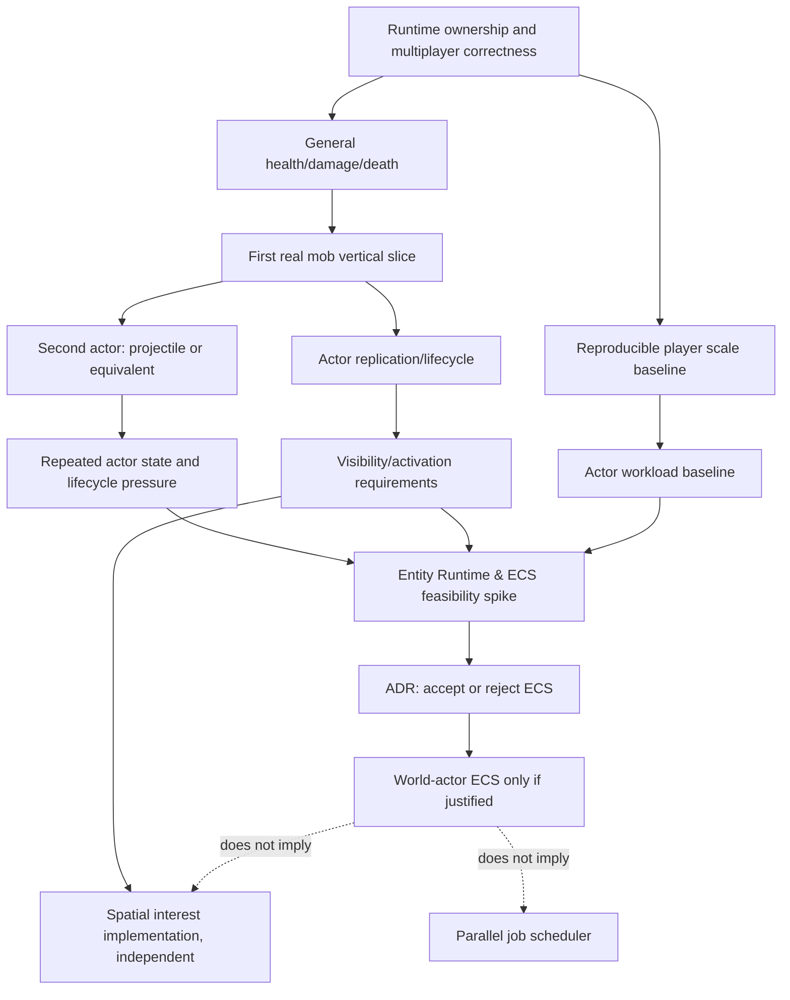

# Zenith maturity and ECS-readiness audit

**Baseline:** `10517afaf30fde34437f24025e6a01d48eabf6e2` (`develop`, 2026-08-11, post-integration revalidation).

**Scope:** source, leaf libraries, tests, benchmarks, CI, documentation, recent history, local reference clones in `D:\Development\bedrock`, and smoke-tooling references. This revision also accounts for the committed health/actor slices and protocol-independent command slice after the original audit.

## Executive summary

Zenith is a **functional/characterized multiplayer alpha**, not a mature Bedrock server. It has a real authoritative spine: clients join, see peers, move, chat, edit terrain, use inventory/chests/crafting, persist selected state, die/respawn, observe floor-item/falling-block actors, and now exercise concrete Zombie and Projectile slices plus a protocol-independent command slice. The strongest maturity is the enforced split: gameplay decides on the single-writer tick, Protocol transmits, and Packets serialize.

Zenith is **feature-limited first and validation-limited second; it is not currently architecture-limited by missing ECS**. HealthState and one concrete Zombie now exist, but the immediate missing capabilities are a materially different second actor, shared lifecycle/replication evidence, visibility requirements and measured actor/observer workloads. The current GameLoop is a strong basis for a future single-thread ECS, but does not establish a need for one.

Phase-D evidence makes Zenith **READY FOR AN ECS FEASIBILITY SPIKE**, not ready to adopt ECS. The second actor, direct actor-churn/observer measurements, repeated lifecycle pressure and visibility requirements are recorded in [`phase-d-actor-pressure.md`](../phase-d-actor-pressure.md). The spike must still compare and falsify an internal world-actor-only archetype/SoA hypothesis before architecture changes or public API.

## Evidence and documentation authority

| Authority | Canonical use |
|---|---|
| `ARCHITECTURE.md` | layer, ownership, runtime and freeze invariants |
| committed source + tests + smoke evidence | current implementation status |
| `docs/roadmap.md` | current sequence, gates, NOW/NEXT/LATER |
| `docs/decisions.md` | ADR history and rationale |
| this audit | point-in-time maturity and ECS evidence |

| Topic | Classification | Evidence / disposition |
|---|---|---|
| Layer split and single writer | DOCUMENTED AND IMPLEMENTED | `ARCHITECTURE.md`, `GameLoop.cs`, `ArchitectureBoundaryTests.cs` |
| LAN multiplayer/inventory/chest persistence | DOCUMENTED AND IMPLEMENTED | `alpha-gate.md`, smoke rows, intent and duplication tests |
| Falling block actor | DOCUMENTED AND IMPLEMENTED | ADR §95, `GravitySystem.cs`, `GravityTests.cs` |
| Health/damage | DOCUMENTED AND IMPLEMENTED, STILL PARTIAL IN BREADTH | ADR §§96/98; HealthState and fall/void/melee paths exist; effects/mitigation/attribution remain absent |
| Floor item actor | DOCUMENTED BUT PARTIAL | `FloorDropStore.cs`: sparse cell/TTL/pickup, not general free actor lifecycle |
| Runtime load harness | DOCUMENTED AND IMPLEMENTED | `RuntimeLoadHarness.cs`, `docs/runtime-validation.md`, `GameLoopTests.cs`, commit `8a9bbb3`; it remains a synthetic player baseline, not actor-scale proof |
| Runtime validation | DOCUMENTED AND IMPLEMENTED | `RuntimeLoadHarness.cs`, `docs/runtime-validation.md`, GameLoop tests and committed baseline; actor-scale proof remains absent |
| H1/Yes-next as active future | OBSOLETE DOCUMENTATION | H1 is closed; roadmap now tracks actor/ECS dependency gates |
| ECS, generic WorldEntity, VisibilitySystem frozen | DOCUMENTED AND IMPLEMENTED AS CONSTRAINT | architecture + ADR §99; no generic layer exists |

## Current capability map

States: **Absent**, **Prototype**, **Functional**, **Characterized**, **Hardened**, **Scale-tested**, **Production-proven**. Hardened means concrete invariants/failure paths are tested, not public-production maturity.

| Capability | Current capability | Known limitation / next capability | Evidence | Maturity |
|---|---|---|---|---|
| Networking/session | owned RakNet, session SM, ordered channels, shutdown | hostile-network operations/telemetry | `src/raknet`, lifetime tests, ADR §94 | Characterized |
| Protocol | 2169 critical wire paths, generator, smoke | no complete protocol conformance/live matrix | packet tests, ADR §§79–94 | Functional |
| Runtime ownership | ordered single-writer 20 TPS GameLoop, intents | no actor budgets/telemetry | `GameLoop.cs`, boundary/intent tests | Hardened |
| World | terrain, overlays, Dimension seam, sand/gravel gravity | fluids/redstone/block breadth/multiworld | `World/`, terrain/gravity tests | Functional |
| Movement | authoritative player movement/fall/void | no full collision/anti-cheat proof | `MovementSystem.cs`, fall tests | Functional |
| Health/damage | health, fall/void death/respawn and explicit melee source | no mitigation, effects, knockback or attribution breadth | `HealthState`, `Player.cs`, ADR §§96/98 | Functional |
| Inventory | ISR, craft/chests, persistence and conservation | broader item semantics/actor interactions | inventory tests | Hardened |
| Persistence | Zenith LevelDB overlays/inventory/chest/player data | in-flight actors RAM-only, no actor persistence contract | storage tests | Functional |
| Player replication | join/leave, dirty pose, skin/equipment | all-online fan-out; no interest policy | `PlayerVisibility.cs`, movement tests | Functional |
| Non-player replication | item/falling-block packets | bespoke paths, no shared lifecycle/observer contract | `EntityProtocol.cs`, `ColumnSend.cs` | Prototype |
| Visibility/interest | player visibility + known-chunk checks | no spatial actor interest/activation policy | `PlayerChunkTracker.cs`, `FloorDropFanout.cs` | Prototype |
| Dynamic actors | falling blocks, floor drops, concrete Zombie and Projectile | direct-model duplication/interest pressure characterized; no common runtime accepted | `ProjectileSystem`, Phase-D findings | Characterized |
| AI/navigation | Zombie proximity targeting/movement only | no navigation/pathfinding/behavior scheduling | `ZombieSystem.cs` | Prototype |
| Load/observability | hot-path BenchmarkDotNet; reproducible player and actor-churn harnesses | real-client scale, CPU and retained-memory profiles | `RuntimeLoadHarness.cs`, Phase-D findings | Characterized |
| Testing | leaf/unit suite, architecture tests, human smoke | Bedrock E2E not in CI | CI, `alpha-gate.md` | Characterized |
| Operations | Docker/compose/config/graceful flush | backup/recovery/SLOs/public hardening | deploy docs | Prototype |
| Commands / operator UX | protocol-independent core plus Bedrock `AvailableCommands` metadata/autocomplete for a small slice | broader command coverage and plugin-facing surface remain deferred | `CommandCatalog`, `CommandRuntime`, adapter tests/smoke, ADR §100 | Functional |
| Extensibility | internal EventBus with one consumer | no public plugin API; correct intentional freeze | ADR §78 | Prototype |

## Mature server comparison

Local source snapshots: PocketMine `6a7cc02e` (2026-07-09), PowerNukkitX `1a73a6792` (2026-08-10), Dragonfly `1c821161` (2026-08-09). They are problem catalogues, not implementation templates.

| Concern | PocketMine-MP | PowerNukkitX / Nukkit family | Dragonfly | Zenith lesson |
|---|---|---|---|---|
| Representation | broad `Entity` base hierarchy/factory/subclasses | broad `Entity extends Location`, creature hierarchy | `EntityHandle`/`EntityData`, `Ent` delegates per-type `Behaviour` | identity/lifecycle/wire concerns are universal; representation is not |
| Tick | `onUpdate` + scheduled update | `onUpdate` + scheduled update | ticks entities in visible/ticking chunks | activation is a separate future concern |
| Visibility | spawn/despawn to players tied to used chunks | spawn/despawn/viewer tracking | chunk viewers, show/hide on crossings, `Tx.Viewers` | interest policy is required when actor fan-out grows |
| AI | deliberately not vanilla-mob complete | behavior groups/sensors/controllers/memory/A* | behavior-specific movement/projectile/item logic | AI scheduling/search does not imply ECS |
| Extensibility | mature plugin API | custom entities/events | library interfaces | do not freeze Zenith’s entity API before its internal model is known |
| Cost visible in source | hierarchy/API compatibility burden | very large Entity + substantial AI machinery | still has synchronized world/chunk-viewer machinery | do not copy an inheritance tree or a mini-ECS |

Evidence: PMMP `src/entity/Entity.php` exposes `onUpdate`, `scheduleUpdate`, `spawnTo`, `despawnFrom`; PowerNukkitX `org/powernukkitx/entity/Entity.java` does likewise and has behavior/route subtrees; Dragonfly `server/world/{entity,world,tick}.go` holds entities by chunk and viewers, while `server/entity/ent.go` delegates to `Behaviour.Tick`.

### Capability maturity matrix

| Capability | Zenith | PMMP | PNX/Nukkit | Dragonfly | Evidence / gap | ECS prerequisite? |
|---|---|---|---|---|---|---|
| Runtime ownership | Hardened | Production-proven | Production-proven | Production-proven | single writer + intent tests | Foundation done |
| Network/session | Characterized | Production-proven | Production-proven | Production-proven | owned transport/NACK fix | No |
| Player replication | Functional | Production-proven | Production-proven | Production-proven | global fan-out | No |
| Inventory | Hardened | Hardened | Hardened | Functional/Hardened | conservation tests | No |
| Health/damage | Prototype | Hardened | Hardened | Functional/Hardened | fall/void only | Yes |
| Actor identity/lifecycle | Prototype | Hardened | Hardened | Hardened | per-feature stores/IDs | Yes |
| Actor replication | Prototype | Hardened | Hardened | Hardened | bespoke paths | Yes |
| Visibility/interest | Prototype | Hardened | Hardened | Hardened | requirements unknown | Requirements first |
| Dropped item | Prototype | Hardened | Hardened | Functional/Hardened | sparse cell only | Useful evidence |
| Falling block | Functional | Functional/Hardened | Functional/Hardened | Functional/Hardened | active multi-tick path | Useful evidence done |
| Mob/second actor | Absent | Functional | Hardened | Functional | no mob/projectile | Yes |
| Navigation/AI | Absent | deliberately limited | Hardened | behavior-specific | after actor foundation | No |
| Actor workload | Absent/in-flight | Scale-tested | Scale-tested | Characterized | player harness only/in flight | Yes |
| Entity/plugin API | Absent intentionally | Production-proven | Production-proven | Production-proven | must remain unfrozen | Must remain unfrozen |

### Where Zenith is ahead / behind / incomparable

**Ahead structurally:** strict gameplay/protocol/packet separation; single-writer authority; reusable owned NBT/LevelDB leaves; documented freezes; inventory conservation tests. This is design quality, not production maturity.

**Behind:** actor breadth, vanilla mechanics, interest management, AI/navigation, operational hardening, Bedrock E2E CI, extensions and accumulated edge cases.

**Not comparable yet:** capacity, TPS, extension ergonomics and entity performance. No committed representative actor workload exists.

## Maturity gaps

| Gap class | Concrete gaps |
|---|---|
| Missing feature | general damage, mobs, projectile, item physics, AI/navigation, effects, richer world interaction |
| Missing architecture | actor lifecycle/identity/replication contract; later interest management; not yet ECS |
| Missing validation | live fall/ISR smoke, automated client smoke in CI, reproducible load report |
| Missing scale proof | actor iteration/churn/query/observer fan-out/memory envelope |
| Missing operations | backup/restore, public hardening, capacity SLOs, alerting, recovery drills |

## Dependency graph

Inventory/container multi-owner transaction pressure is a separate branch. It may share resource invariants with actors but does not justify putting inventory in ECS.

## ECS readiness matrix

**2 DONE, 3 PARTIAL, 8 NOT STARTED.** The count is a checklist, not a forecast; partial does not count as complete.

| Prerequisite | Status | Evidence / done condition |
|---|---|---|
| Runtime/load harness | DONE | committed player harness documents command/fixture and outputs tick, allocation, GC and egress metrics |
| Entity workload baseline | DONE | real Projectile churn at 100/1,000 actors with one and ten observers |
| Dropped-item lifecycle | PARTIAL | cell pickup/TTL exists; free actor lifecycle/physics does not |
| Falling-block lifecycle | DONE | ADR §95, active multi-tick actor, tests/smoke |
| Health/damage | DONE for current gate | HealthState and source/atomic-death tests; breadth remains intentionally limited |
| First mob | DONE | Zombie lifecycle and two-client evidence |
| Second actor behavior | DONE | Projectile has velocity, owner, collision and short lifetime |
| Projectile/equivalent | DONE | focused tests plus two-client lifecycle smoke evidence |
| Entity replication | DONE for decision evidence | spawn/move/remove/late-join paths, with duplication documented |
| Visibility requirements | DONE | current global/known-chunk semantics and fan-out evidence documented |
| Repeated actor-state patterns | DONE | FallingBlock, Zombie and Projectile; FloorDrop is qualified supporting evidence |
| Natural component-like queries | DONE | active/tick, target, collision and observer queries enumerated without a query API |
| Iteration/lifecycle measurable | DONE | p50/p95/p99/max, allocation/GC, egress and real churn |

### ECS too early signals

- Components are being named before three actor paths exist.
- The desired result is “clean architecture”, multithreading, or global-fan-out relief rather than a measured simulation limitation.
- Visibility/activation/replication requirements are unknown.
- A generic `Entity → LivingEntity → Mob` tree or a component registry exists only to make the first mob compile.
- The benchmark uses synthetic components unlike real Zenith actors.

### ECS too late signals

- Three or more stores duplicate position/velocity/age/identity/despawn state.
- Overlapping lists or central type switches grow with each actor.
- Two current features are blocked by inheritance/type checks or need the same lifecycle/replication change.
- A public entity/custom-actor API is about to freeze around the premature model.

## Before the decision / after the decision

| Capability | Classification |
|---|---|
| General health/damage ownership | Must precede |
| Actor IDs and spawn/move/remove replication | Must precede |
| First mob + materially different second actor | Must precede |
| Reproducible actor workload and visibility requirements | Must precede |
| Dropped item movement/merge/pickup and falling block | Useful evidence before decision |
| Navigation/pathfinding/AI scheduling | Can follow decision |
| Effects, actor persistence breadth, many mobs | Can follow decision |
| Public plugins/custom actor API | Must wait until after decision |
| Command parsing/registration/autocomplete | Can evolve independently from ECS; plugin command hooks wait |

## ECS feasibility spike

Open the spike only after the gate below. Compare the then-current straightforward world-actor representation against an internal archetype/SoA prototype—never a server rewrite or public API. Use real Zenith mixes (mobs, falling blocks, items, projectile, spawn/despawn, damage and actual observers), at 100, 1,000, 10,000 and 50,000 actors only while previous scales remain meaningful.

Measure tick average/p50/p95/p99/max, CPU, allocation, GC, retained memory, iteration throughput, query cost, structural add/remove, creation/destruction, and replication bytes/fan-out. Start single-writer. Job scheduling needs its own ADR with read/write and structural-change evidence.

**Accept** only if representative workloads materially improve or demonstrated cross-cutting complexity decreases. **Falsify** if simple actors meet the capacity target, the bottleneck is network/visibility/world I/O, or ECS worsens churn/allocation/complexity.

## Revised roadmap rationale

The concise canonical version is [`docs/roadmap.md`](../roadmap.md).

| Phase | Objective | Exit evidence | Unlocks | Explicitly deferred |
|---|---|---|---|---|
| A Runtime proof | characterize player runtime/scale baseline | reproducible report, invariants, smoke status | honest capacity envelope | ECS, visibility system, jobs |
| B Survival state core | general health/damage/death | HealthState, source/cause tests, atomic death/drop/respawn | actor interaction | hunger/armor/effects breadth |
| C First actor | one mob vertical slice | Zombie lifecycle/replication/interaction tests and smoke evidence | second actor | inheritance/AI framework |
| D Actor pressure | second actor, workload, visibility requirements | repeated patterns + measurements | ECS decision | speculative visibility impl |
| E Decision | simple vs ECS comparison | benchmark + ADR accept/reject | limited ECS if accepted | players/inventory/jobs in ECS |
| F Scale/behavior | expand actor, AI and interest independently | per-domain gates | extension surface later | public API before stability |
| G Production | E2E CI and operations | beta gate/SLOs/recovery proof | beta decision | parity chase |

## Next three recommended goals

1. **Characterize the concrete Zombie slice.** Proves the remaining spawn/late-join/health/movement/removal observations and records direct-model lifecycle cost. It does not add a generic Entity hierarchy, ECS or plugin API.
2. **Deliver a materially different second actor.** Prefer a projectile or equivalent with collision, short lifetime and observer updates; prove which state/lifecycle patterns are genuinely shared. It does not add a component registry or visibility framework.
3. **Build the actor pressure baseline.** Measure simulation separately from replication/observer fan-out across meaningful populations and document visibility/activation requirements. It does not implement ECS, parallel jobs or assume ECS solves visibility.

## ECS decision gate

Open **Entity Runtime & ECS Feasibility Spike** only when all are true:

- The runtime baseline is committed, reproducible and records a defined 20-TPS envelope.
- General damage/health/death is tested, including no partial inventory/drop commit.
- A mob and materially different second actor exist and are observed by multiple clients.
- Actor IDs and spawn/move/remove/rejoin/known-chunk semantics are tested.
- Actor workload includes simulation and replication/observer cost.
- Visibility/activation requirements are documented.
- At least two current features demonstrate repeated state/query/lifecycle pressure.
- No public entity/plugin API has frozen the premature model.
- Benchmark design and ADR question are approved.

## Post-ECS path, only if accepted

Limit it initially to **world actors**: mobs, projectiles, dropped items, falling blocks and similar dynamics. Players, sessions, RakNet, packets/protocol, inventory/containers, storage, commands and plugin runtime remain outside by default. First phase stays single-writer. ECS may unlock composition, actor growth, AI scheduling and later extension seams; it does not solve network visibility or imply parallel execution.

## Direct answers

| Question | Answer |
|---|---|
| Architecture-limited or feature-limited? | Feature-limited first; validation/scale proof next; ECS absence is not the blocker. |
| Mature capabilities before ECS? | General damage, two real actor behaviors, lifecycle/replication, visibility requirements, actor workloads. |
| Mature capabilities that wait? | Broad AI, effects, persistence breadth, plugin API, production ops, jobs and parity. |
| Minimum entity set? | Falling block + improved item/equivalent, one mob, one projectile/second behavior, shared replication/lifecycle tests and workload data. |
| When does waiting become debt? | When ≥3 paths duplicate actor state/stores/type-switches or public entity API is imminent. |
| When is ECS premature? | Still now: only one concrete mob exists; no materially different second actor, shared lifecycle pressure, visibility requirements or actor benchmark. |
| Is GameLoop a good base? | Yes for single-writer ECS; no implication of parallel ECS. |
| Players in ECS? | Later or potentially never; they are session/inventory-heavy. |
| Outside ECS? | Sessions, RakNet, packets/protocol, inventory/containers, storage, commands, plugin runtime; players by default. |
| Visibility timing? | Requirements precede decision; implementation evolves independently when fan-out warrants it. |
| Worthwhile benchmark? | Real simple-vs-SoA/archetype actors with tail tick/alloc/memory and lifecycle/fan-out measures. |
| Falsifier? | Simple model meets target, bottleneck is network/visibility/I/O, or ECS makes churn/complexity worse. |
| Next goals? | Characterize Zombie; add a materially different second actor; measure actor simulation versus observer fan-out. |
